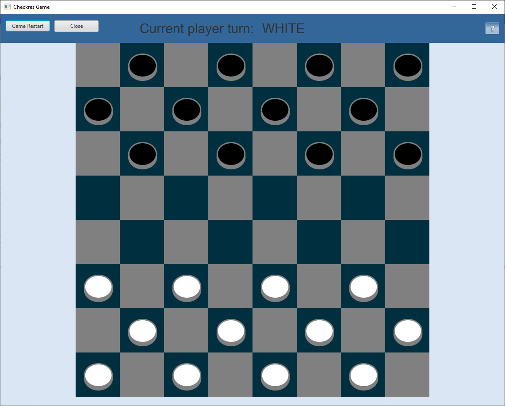

# Checkers Game
> Checkers Game with JavaFX interface

## Table of contents
* [General info](#general-info)
* [Screenshots](#screenshots)
* [Technologies](#technologies)
* [Setup](#setup)
* [Features](#features)
* [Status](#status)
* [Inspiration](#inspiration)
* [Contact](#contact)

## General info
Project was created as programming practise to learn how to use JavaFX library.

## Screenshots

## Technologies
* Java 8
* JUnit 4
* JavaFX

## Setup
1. Build with command `gradlew build`

## Features
List of features:
* Restart unfinished game
* Turn indication 
* Queen functionality

To-do list:
* None

## Status
Project is: _finished_.

## Inspiration
Project inspired by web.

## Contact
Created by [@AdamSobieraj](https://github.com/AdamSobieraj) - feel free to contact me!